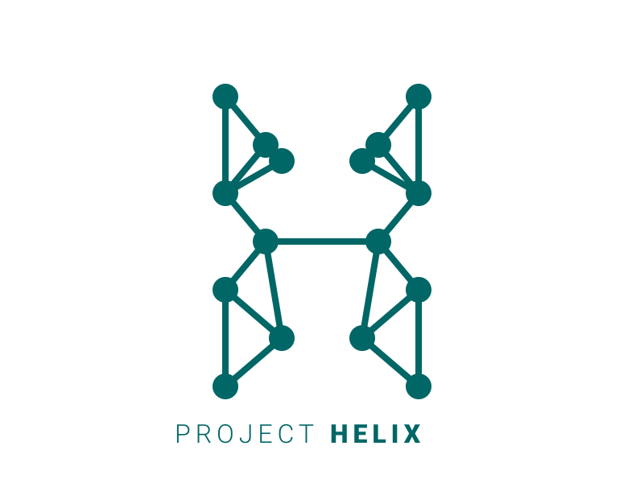

# 🧪 Project Helix

<p align="center">
  
</p>

<p align="center">
  <strong>A data-science project exploring the chemical elements through data.</strong>
</p>

<p align="center">
  
  
  
</p>

---

## 📖 About

**Project Helix** is a personal data-science and software project focused on building, validating, documenting, and eventually analyzing structured data about the chemical elements.

The project is being developed publicly with an emphasis on **understanding the data and the code behind it**, rather than simply producing an end result.

Helix is intentionally being built step-by-step:

> **Data → Validation → Documentation → Understanding → Analysis → Modeling**

---

## 🚧 Current Status

### Dataset v1 — ✅ Complete

The first version of the Helix dataset contains:

* **118 chemical elements**
* **15 features**
* JSON → pandas DataFrame → CSV pipeline
* Automated structural validation
* Missing-value analysis
* Source/provenance coverage validation
* Documented data-quality concerns

**Dataset status:** `Initial / Raw`

Missing values have **not** been imputed, replaced, or fabricated.

---

## 🎯 Project Goals

Helix is being developed through several stages:

1. Build a structured dataset of all chemical elements.
2. Understand and document every feature.
3. Audit data provenance and quality.
4. Perform exploratory data analysis.
5. Identify meaningful relationships and patterns.
6. Build software tools around the dataset.
7. Explore appropriate data-science and machine-learning applications.

The primary goal is **data quality and understanding before modeling**.

---

# 📊 Dataset

## Dataset v1

| Property        |             Value |
| --------------- | ----------------: |
| Elements        |           **118** |
| Features        |            **15** |
| Version         |            **v1** |
| Status          | **Initial / Raw** |
| Missing values  |        Documented |
| Imputation      |              None |
| Source coverage |         118 / 118 |

---

## 🔬 Features

| Feature                     | Description                                            |
| --------------------------- | ------------------------------------------------------ |
| `number`                    | Atomic number                                          |
| `symbol`                    | Chemical symbol                                        |
| `name`                      | Element name                                           |
| `atomic_mass`               | Atomic mass value provided by the source dataset       |
| `category`                  | Element classification/category                        |
| `period`                    | Periodic-table period                                  |
| `group`                     | Periodic-table group                                   |
| `block`                     | Periodic-table block                                   |
| `density`                   | Density value provided by the source dataset           |
| `melt`                      | Melting-point value provided by the source dataset     |
| `boil`                      | Boiling-point value provided by the source dataset     |
| `molar_heat`                | Molar heat value provided by the source dataset        |
| `electron_affinity`         | Electron-affinity value provided by the source dataset |
| `electronegativity_pauling` | Pauling electronegativity value                        |
| `electron_configuration`    | Electron configuration                                 |

> **Note:** Feature definitions, units, and property-level provenance are still being formally audited.

---

# 🔬 Data Pipeline

```text
PeriodicTableJSON.json
          │
          ▼
        Python
          │
          ▼
   Filter elements
   atomic number ≤ 118
          │
          ▼
    pandas DataFrame
          │
          ▼
    Select 15 features
          │
          ▼
   Data-quality checks
          │
          ▼
      Dataset v1
          │
          ▼
          CSV
```

---

# ✅ Data Quality

Helix currently performs automated checks for:

### Dataset Structure

* Exactly **118 elements**
* Exactly **15 selected features**
* Atomic numbers `1 → 118`

### Uniqueness

The following fields must contain 118 unique values:

* `number`
* `symbol`
* `name`

### Periodic Table Structure

* `period` must be between `1` and `7`
* `group` must be between `1` and `18`
* `block` must be one of:

  * `s`
  * `p`
  * `d`
  * `f`

### Required Values

* `atomic_mass` must be greater than zero
* `symbol` must not be missing
* `name` must not be missing

---

# 📉 Missing Values

Dataset v1 currently contains missing values in six features:

| Feature                     | Missing | Percentage |
| --------------------------- | ------: | ---------: |
| `density`                   |       4 |       3.4% |
| `melt`                      |      11 |       9.3% |
| `boil`                      |      14 |      11.9% |
| `molar_heat`                |      40 |      33.9% |
| `electron_affinity`         |       9 |       7.6% |
| `electronegativity_pauling` |      18 |      15.3% |

### Current Policy

Missing values are deliberately **not** imputed.

Before any value is changed, Helix will investigate:

* Why the value is missing.
* Whether the property is meaningful for that element.
* Whether a reliable value exists elsewhere.
* Whether sources use different conventions.
* Whether missingness is associated with specific elements or groups.

---

# 🔗 Source & Provenance

The initial dataset was derived from a periodic-table JSON dataset.

Every element record contains a `source` field.

Current validation has established:

* **118 / 118** elements have a source entry.
* **118 / 118** source URLs are unique.
* Each source points to the corresponding element's Wikipedia page.

### ⚠️ Important

An element-level source URL does **not** automatically mean that every individual property has been independently verified against that source.

Property-level provenance is therefore still under investigation.

---

# 🧪 Known Data Concerns

Current concerns include:

* Some properties have substantial missingness.
* Property-level provenance has not yet been fully audited.
* Feature definitions and units need to be formally documented.
* Heavy and synthetic elements require particular attention.
* The original source dataset should not automatically be treated as authoritative for every individual property.

These limitations are intentionally documented rather than hidden.

---

# 🗺️ Roadmap

## Phase 1 — Dataset v1 ✅

* [x] Obtain initial element dataset
* [x] Parse JSON
* [x] Build pandas DataFrame
* [x] Select 15 features
* [x] Validate 118 elements
* [x] Validate identifiers
* [x] Validate periodic-table structure
* [x] Analyze missing values
* [x] Document data-quality concerns
* [x] Validate source coverage

## Phase 2 — Data Verification 🔄

* [ ] Build complete data dictionary
* [ ] Define every feature precisely
* [ ] Document units
* [ ] Audit property-level provenance
* [ ] Investigate missing values
* [ ] Identify potential inconsistencies
* [ ] Determine whether a verified Dataset v1.1 is necessary

## Phase 3 — Exploratory Data Analysis

* [ ] Statistical summaries
* [ ] Distribution analysis
* [ ] Correlation analysis
* [ ] Data visualizations
* [ ] Investigate relationships between chemical properties

## Phase 4 — Helix Software

* [ ] Create reusable data-loading layer
* [ ] Build a Python API
* [ ] Expose validated element data
* [ ] Create API documentation

## Phase 5 — Data Science

* [ ] Identify meaningful analytical questions
* [ ] Feature engineering
* [ ] Statistical modeling
* [ ] Explore suitable machine-learning applications
* [ ] Evaluate models rigorously

---

# 🛠️ Tech Stack

| Technology | Purpose                        |
| ---------- | ------------------------------ |
| **Python** | Data processing and validation |
| **pandas** | Data manipulation and analysis |
| **JSON**   | Initial dataset format         |
| **CSV**    | Dataset v1 storage             |
| **Git**    | Version control                |
| **GitHub** | Public development             |

Additional technologies will be introduced only when they serve a clear purpose.

---

# 📁 Project Structure

```text
Project-Helix/
│
├── src/
│   └── PeriodicTableJSON.json
│
├── data/
│   └── dataset_v1.csv
│
├── docs/
│   ├── data-quality-report.md
│   └── status.md
│
├── README.md
├── requirements.txt
└── ...
```

The project structure will evolve as Helix develops.

---

# 🧠 Philosophy

Helix follows one central principle:

> **Understand the data before trying to model it.**

Machine learning is not the starting point.

A model built on poorly understood or poorly documented data can produce impressive-looking results while being fundamentally unreliable.

Therefore, Helix prioritizes:

```text
DATA
  ↓
VALIDATION
  ↓
DOCUMENTATION
  ↓
UNDERSTANDING
  ↓
ANALYSIS
  ↓
MODELING
```

---

# 📌 Dataset Status

| Field                     | Status                  |
| ------------------------- | ----------------------- |
| Version                   | **Dataset v1**          |
| Elements                  | **118**                 |
| Features                  | **15**                  |
| Status                    | **Initial / Raw**       |
| Missing values            | **Documented**          |
| Imputation                | **None**                |
| Source coverage           | **Validated**           |
| Property-level provenance | **Under investigation** |

---

# 👤 Project

**Project Helix** is being developed as a personal data-science and software project focused on learning, experimentation, reproducibility, and public development.

Built to understand.

Built to validate.

Built to explore.

**This is Helix. 🧪**
